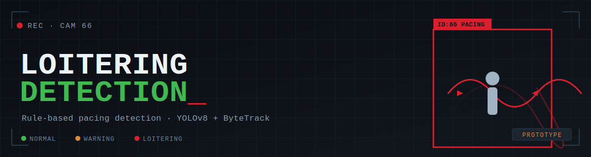
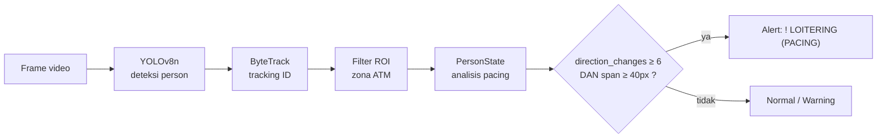

<p align="center">
  
</p>

<h1 align="center">🚶‍♂️ Computer Vision for Human Loitering Detection 🚶‍♀️</h1>
<p align="center"><i>"Mengenali pola mondar-mandir, bukan menghakimi orang."</i></p>
<p align="center">Prototipe Computer Vision Rule-Based · Deteksi Potensi Loitering pada CCTV ATM</p>

<p align="center">
  
  
  
</p>

<p align="center">
  
  
  
  
  
</p>

---

## Apa ini (dan apa yang BUKAN)

Proyek ini adalah **prototipe akademik** untuk mendeteksi pola pergerakan
mondar-mandir di zona ATM. Sistem **tidak** melatih model klasifikasi loitering —
loitering disimpulkan murni dari **heuristik temporal-spasial** pada lintasan
(trajectory) orang yang dilacak.

| Komponen                  | Peran                        | Catatan                                       |
| ------------------------- | ---------------------------- | --------------------------------------------- |
| YOLOv8n (`ultralytics`)   | Deteksi **person**           | _Pretrained_, bukan klasifikator loitering    |
| ByteTrack (`supervision`) | **Tracking** (penjejakan ID) | Hanya asosiasi ID, bukan klasifikasi perilaku |
| Aturan di `tracker.py`    | **Loitering = pacing**       | Heuristik, bukan model terlatih               |
| Optical flow + heatmap    | **Bukti visual** pendukung   | Tidak menghasilkan label/prediksi             |

> **Penting:** sistem ini **tidak** mendeteksi niat kriminal, penipuan, tampering,
> atau perampokan. Ia hanya mengenali **pola pergerakan yang dapat diamati**
> berdasarkan aturan yang telah ditentukan.

---

## Cara Kerja (Pipeline)



Tingkatan interpretasi:

- **Level 0** — Person terdeteksi oleh YOLOv8.
- **Level 1** — Person dilacak konsisten oleh ByteTrack.
- **Level 2** — Pusat _bounding box_ berosilasi horizontal (bolak-balik kiri-kanan).
- **Level 3** — Osilasi memenuhi dua syarat sekaligus → **alert loitering**.

### Definisi pacing yang dipakai

Sebuah track ditandai **loitering** hanya jika **kedua** syarat terpenuhi:

1. **Jumlah pergantian arah** horizontal `direction_changes >= PACING_DIRECTION_CHANGE_THRESHOLD` (default 6), **dan**
2. **Rentang gerak** horizontal `span >= PACING_MIN_SPAN_PX` (default 40 px).

Syarat ke-2 (span) mencegah _false positive_ dari orang yang **diam** namun
_bounding box_-nya bergetar di tempat — getaran sempit tidak dihitung sebagai
mondar-mandir meski sempat berganti arah berkali-kali.

### Kode warna pada output

| Warna  | Arti                                              |
| ------ | ------------------------------------------------- |
| Hijau  | Person terdeteksi & dilacak — **bukan** loitering |
| Oranye | Mendekati ambang (warning)                        |
| Merah  | **Loitering terdeteksi** (pacing)                 |
| Kuning | Garis ROI / zona ATM                              |

---

## Struktur Proyek

```
loitering/
├── main.py              # Entry point CLI: proses video/folder, output, evaluasi
├── detector.py          # YOLOv8 + ByteTrack + filter ROI + anotasi frame + events
├── tracker.py           # PersonState, LoiteringFlags, logika pacing, ghost tracking
├── motion_analysis.py   # Optical flow (Farneback) + presence heatmap (bukti visual)
├── config.py            # Threshold, ROI, path model, warna, output
├── utils.py             # Loader anotasi, ROI selector, logger CSV, screenshot, summary
├── annotation.txt       # Metadata video + rentang frame (lihat catatan evaluasi)
├── requirements.txt     # Dependensi
├── yolov8n.pt           # Bobot YOLOv8n pretrained
├── videos/              # Input video
└── output/              # Hasil: video beranotasi, screenshot, heatmap, events.csv
```

---

## Instalasi

```bash
# (disarankan) buat virtual environment
python -m venv .venv
# Windows
.venv\Scripts\activate
# Linux/macOS
source .venv/bin/activate

pip install -r requirements.txt
```

Dependensi inti: `ultralytics`, `opencv-python`, `numpy`, `supervision`.

---

## Penggunaan

```bash
# Proses satu video
python main.py --video videos/66.mp4

# Tanpa tampilan jendela (lebih cepat, cocok untuk headless)
python main.py --video videos/66.mp4 --no-display

# Tentukan ROI manual (x1 y1 x2 y2)
python main.py --video videos/66.mp4 --roi 100 80 540 420

# Pilih ROI interaktif (drag pada frame pertama)
python main.py --video videos/66.mp4 --set-roi

# Proses seluruh folder
python main.py --folder videos/

# Evaluasi terhadap anotasi (lihat catatan di bawah)
python main.py --video videos/66.mp4 --annotation annotation.txt
```

> Catatan: file anotasi bernama **`annotation.txt`** (dipisah spasi), bukan `.csv`.

Output disimpan ke `output/<nama_video>/`: video beranotasi, `events.csv`,
screenshot alert, dan `presence_heatmap.jpg`.

---

## Konfigurasi (`config.py`)

| Parameter                           |      Default | Keterangan                                       |
| ----------------------------------- | -----------: | ------------------------------------------------ |
| `ATM_ROI`                           |       `None` | Zona ATM `(x1,y1,x2,y2)`; `None` = seluruh frame |
| `PACING_DIRECTION_CHANGE_THRESHOLD` |          `6` | Min. pergantian arah agar dianggap pacing        |
| `PACING_WINDOW_FRAMES`              |         `60` | Jendela riwayat arah                             |
| `PACING_MIN_SPAN_PX`                |         `40` | Min. rentang horizontal gerak (anti-getaran)     |
| `MOVEMENT_MIN_DISTANCE_PX`          |         `15` | Pergeseran min. agar dihitung sebagai gerak      |
| `YOLO_CONFIDENCE`                   |       `0.45` | Ambang keyakinan deteksi                         |
| `TRACK_LOST_FRAMES`                 |         `60` | Kesabaran tracker sebelum _drop_ ID              |
| `YOLO_MODEL`                        | `yolov8n.pt` | Bobot model                                      |

> Untuk menurunkan _false positive_, set ROI eksplisit (`--roi` / `--set-roi`)
> alih-alih membiarkan `ATM_ROI = None` (seluruh frame).

---


## 👥 Tim Pengembang

<div align="center">

| No | Nama | NIM |
|:--:|------|-----|
| 1. | **Aulia Gita Pratiwi** | 25 / 572701 / PPA / 07197 |
| 2. | **Farichaturrifqi Aryanitasari** | 25 / 574224 / PPA / 07240 |
| 3. | **Rafel Romero Hirawanto** | 25 / 573260 / PPA / 07216 |
| 4. | **Fajar Sabik** | 25 / 562482 / PPA / 07064 |

<sub>Magister Kecerdasan Artifisial · Universitas Gadjah Mada · Yogyakarta, Indonesia</sub>

</div>

---
